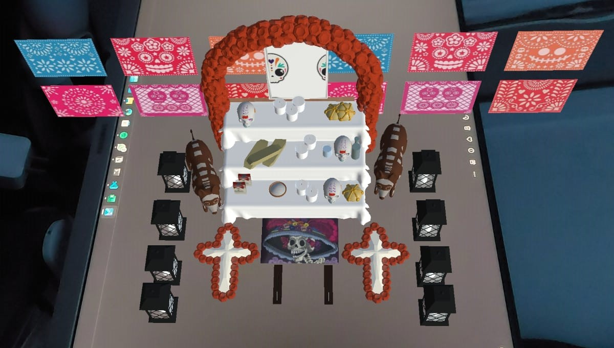

# Ofrenda-graficos-y-animacion

El proyecto consta de modelos hechos en maya, exportado a unity terminando en una aplicación para Android con una ofrenda que aparece cuando es mostrado en camara el [Image Target](Image-Target/Image-Target.jpg).

## Proceso de instalación

1. Descargar el archivo [OfrendaDiaMuertos.apk](Aplicación/OfrendaDiaMuertos.apk) en un dispositivo con sistema operativo Android.
2. Ir a la ubicación de descarga del archivo y hacer la instalación en el sistema

    <image src="./Images/instalacion.jpg" alt="paso 1" width="180">
    <image src="./Images/instalacion2.jpg" alt="paso 1" width="180">

3. Abrir la aplicación (aceptar permiso de acceder a la camara) y colocar el [Image Target](Image-Target/Image-Target.jpg) frente a la camara para poder visualizar el modelo en 3d.

    

## Visualización de escena en Unity

## Modelos elaborados y su autor

